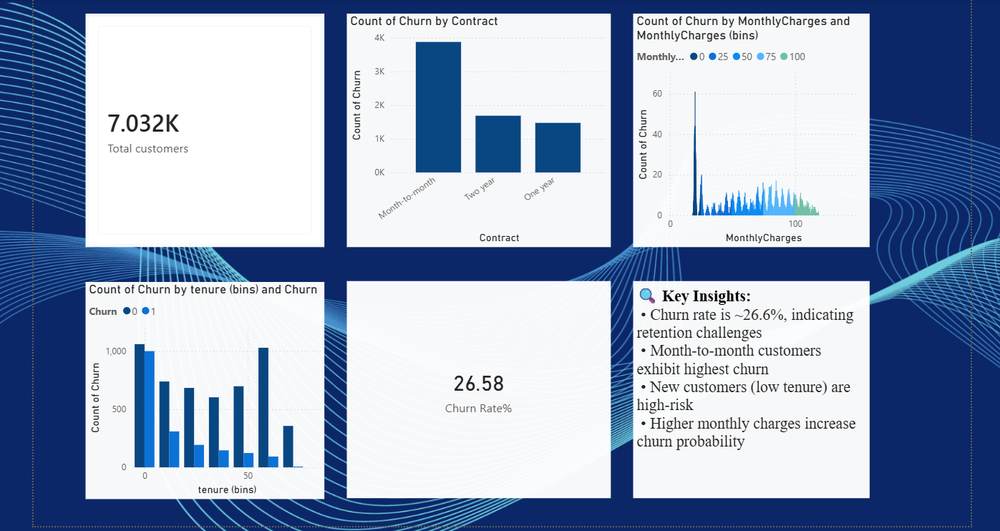

# 📊 Customer Churn Analysis Dashboard

## 🔍 Project Overview
This project analyzes customer churn behavior to identify patterns and improve retention strategies.

## 🎯 Objective
To understand why customers leave and provide actionable business insights.

## 🛠️ Tools Used
- Python (Pandas, NumPy)
- SQL
- Power BI
- Excel

## 📊 Key Insights
- Churn rate is ~26.6%
- Month-to-month customers have highest churn
- New customers are at high risk
- Higher monthly charges increase churn probability

## 💡 Business Recommendations
- Encourage long-term subscriptions
- Improve onboarding experience
- Offer personalized pricing

## 📷 Dashboard

## 📁 Files
- Power BI Dashboard (.pbix)
- Dataset (.csv)
- Analysis notebook (.ipynb)
